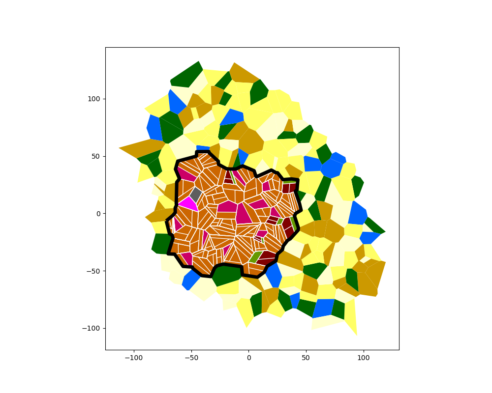

# Medieval City Generator

**~ Thomas Berlioz (Ewaël), Hugo Levy ~**

This Python 3 project randomly generates coherent and realistic medieval cities.

## Installation

Please be sure to install the necessary dependencies with `poetry` first:

```sh
$ pip3 install poetry
$ poetry update
```

## Usage

```
$ python3 city.py --help
usage: city.py [-h] [-o OUTFILE] [-p POPULATION] [-d DENSITY] [--walls] [--castle] [--river]

optional arguments:
  -h, --help            show this help message and exit
  -o OUTFILE, --outfile OUTFILE
                        Path for the outfile
  -p POPULATION, --population POPULATION
                        Population number
  -d DENSITY, --density DENSITY
                        Density for each area
  --walls               Add walls around the city
  --castle              Add a castle in the city
  --river               Add a river (WIP)
```

Go to the source code directory and run the `city.py` script. To view the result, just run `viewer.py` with the path you provided to the generator. Both use `outfiles/city.json` by default.

```
$ cd src/medieval_city_generator
$ python3 city.py -o '../../outfiles/mycity.json' -p 12000 -d 10000 --walls --castle
[INFO] Generating borders for N = 18 and radius = 100
[INFO] Generated city has 67 districts and 168 lands
        - inner surface = 9214.22868710151
        - outer surface = 25285.079917230443
[INFO] Generating assets for inner city
$ python3 viewer.py ../../outfiles/mycity.json
[+] Loaded 185 streets
[+] Rendering city...
```



We highly suggest you to run it with the default values (or `--population 12000`) for the best rendering. It might become incoherent under 5000 and above 25000 for the population.

```
$ python3 city.py; python3 viewer.py
```

## About

The **generator**:
- We generate a coherent set of points according to the given size parameters and we divide them using Voronoi diagram.
- We eliminate the unrealistic shapes on the borders that are too far from the center to keep a roundish city.
- We split those areas into an *inner city* (the actual city with people's houses) and an *outer city* (with nature and farms).
- We fill the both parts with coherent categories:
    * For the *outer city*, with different categories of landscapes, like forests and lakes.
    * For the *inner city*, we firstly put some unique assets like a cathedral and a castle, then we add houses, mansions and parks.
- We add streets around each "district" of the *inner city*.
- If necessary, we add walls around the whole *inner city*.

The **viewer**:
- We associate each category of area to a specific color (see above).
- We plot the streets first, then walls, and finally the whole city.

## Palette

```python
Category.LAND:[255, 255, 205, 1],         # light yellow
Category.FIELD:[255, 255, 102, 1],        # yellow
Category.FOREST:[0, 102, 0, 1],           # dark green
Category.RIVER:[102, 255, 255, 1],        # light blue
Category.LAKE:[0, 102, 255, 1],           # blue
Category.SEA:[0, 0, 204, 1],              # dark blue
Category.PARK:[102, 153, 0, 1],           # green
Category.GARDEN:[102, 255, 51, 1],        # light green
Category.FARM:[204, 153, 0, 1],           # dark yellow
Category.HOUSE:[204, 102, 0, 1],          # orange
Category.MANSION:[128, 0, 0, 1],          # dark red
Category.MARKET:[204, 0, 102, 1],         # dark pink
Category.TOWNHALL:[255, 0, 0, 1],         # red
Category.UNIVERSITY:[153, 51, 255, 1],    # purple
Category.CHURH:[255, 153, 255, 1],        # light pink
Category.CATHEDRAL:[255, 0, 255, 1],      # pink
Category.MONASTRY:[255, 102, 153, 1],     # faded pink
Category.FORT:[165, 165, 165, 1],         # light grey
Category.CASTLE:[94, 94, 94, 1],          # grey
Category.STREET:[223, 223, 223, 1],       # very light grey
Category.BRIDGE:[55, 71, 69, 1],          # dark grey
Category.WALL:[0, 0, 0, 1],               # black
Category.COMPOSITE:[0, 0, 0]              # composite
```
